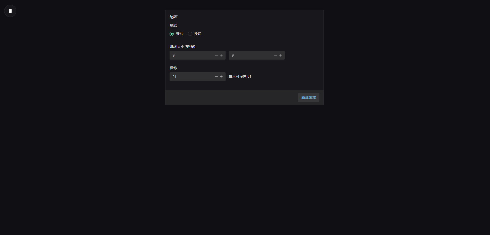

# 不只扫雷

## 介绍

-   支持局域网联机对战（部署服务器也可以，配置下 Nginx 代理即可）一玩家创建房间后，另一名玩家即可通过首页右上角进入。
-   支持自定义地图
-   支持雷自定义动画&颜色

## 启动

```bash
# web端
cd web
npm install
npm run dev

# 服务端
cd server
npm install
node app/index.js
```





